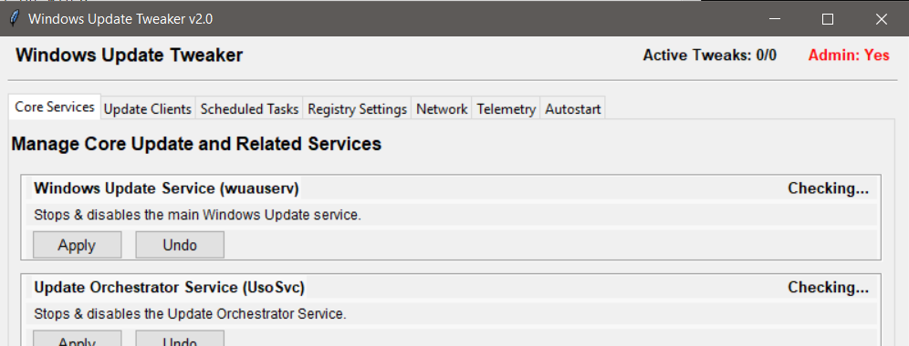

# Windows Update Tweaker

**Version:** 2.0

This Python script provides a graphical user interface (GUI) to apply various tweaks to control and manage Windows Update behavior on Windows 10 and newer operating systems. It aims to give users more granular control over updates by modifying system settings, services, scheduled tasks, startup tasks, and network configurations.



## Features

The tool offers the following reversible tweaks, grouped by category:

### Core Services
1. **Windows Update Service (wuauserv)**
   - Disable: sets start type to Disabled and stops the service immediately.
   - Enable: sets start type to Manual/Demand start (and optionally starts it).
2. **Windows Update Medic Service (WaaSMedicSvc)**
   - Disable: attempts to disable via protected Registry method.
   - Enable: attempts to re-enable to Manual (may fail due to Windows protection).
3. **Update Orchestrator Service (UsoSvc)**
   - Disable: sets start type to Disabled and stops it.
   - Enable: sets start type to Manual.
4. **Windows Modules Installer (TrustedInstaller)**
   - Disable: sets start type to Disabled (and stops).
   - Enable: sets start type to Manual (and can start).

### Telemetry & Diagnostic Services
5. **Connected User Experiences and Telemetry (DiagTrack)**
   - Disable/Enable service.
6. **Diagnostics Tracking Service (dmwappushservice)**
   - Disable/Enable service.
7. **Windows Error Reporting Service (WerSvc)**
   - Disable/Enable service.
8. **Windows Push Notification User Service**
   - Dynamically discovers `WpnUserService_<SID>` service name.
   - Disable/Enable service.
9. **Microsoft Compatibility Appraiser (Mcx2Svc)**
   - Disable/Enable service.

### File & ACL Tweaks
10. **Rename `wuauclt.exe`**
    - Rename `C:\Windows\System32\wuauclt.exe` to `.bak` and vice versa.
11. **Lock `wuauclt.exe` (ACL)**
    - Modify ACL of `wuauclt.exe` to deny writes, and restore default.

### Registry Tweaks
12. **Disable Automatic Updates (`NoAutoUpdate`)**
    - Set or remove `HKLM\SOFTWARE\Policies\Microsoft\Windows\WindowsUpdate\AU\NoAutoUpdate`.
13. **Notification Only (`AUOptions`)**
    - Set or remove `AUOptions=1` for notification-only mode.
14. **Disable Internal WSUS (`UseWUServer`)**
    - Set or remove `UseWUServer=0` to avoid internal WSUS policy.
15. **Disable Consumer Experience (`CloudContent`)**
    - Enable or remove policy to disable consumer features.

### Host & Firewall
16. **Block Update Domains (Hosts File)**
    - Add or remove entries in `C:\Windows\System32\drivers\etc\hosts` to redirect update hostnames.
17. **Block IPs (Firewall Rule)**
    - Create or delete an outbound Windows Firewall rule blocking resolved IPs of update servers.

### Scheduled Tasks
18. **Disable/Enable Windows Update Tasks**
    - Disable or re-enable a predefined list of tasks under `\Microsoft\Windows\UpdateOrchestrator` and `\Microsoft\Windows\WindowsUpdate`.

### Startup Task
19. **Create Autostart Task**
    - Create or delete a Windows Scheduled Task (`WindowsUpdateTweakerAutorun`) to auto-launch the tweaker at logon.

## Apply All / Undo All
- **Apply All**: executes _all_ recommended tweaks in sequence (services, file, registry, hosts, firewall, telemetry extras, autostart, and scheduled tasks) in silent mode.
- **Undo All**: reverts _all_ tweaks back to their original states.

## Requirements

- **Operating System**: Windows 10 or newer.
- **Python**: Python 3.6+ installed.
- **Administrator Privileges**: Must be run with Administrator rights; otherwise most tweaks will fail with Access Denied.

## Installation & Usage

1. Download or clone the repository containing `WindowsUpdateTweaker3.py`.
2. Open a Command Prompt or PowerShell **as Administrator**.
3. Navigate to the script directory.
4. Run:
   ```powershell
   python WindowsUpdateTweaker.py
   ```
5. The GUI displays the current status of each tweak. Use the **Apply**, **Undo**, **Apply All**, and **Undo All** buttons to manage them.

## How It Works

- **Services**: Utilizes `sc.exe` for `config`, `start`, and `stop`. Protected services (e.g., WaaSMedicSvc) may use registry-based methods.
- **Hosts File**: Directly appends/removes entries to the Hosts file.
- **Registry**: Uses `winreg` for policy keys under `HKLM`.
- **File ACLs & Rename**: Employs `takeown.exe`, `icacls.exe`, and `os.rename` with TrustedInstaller ownership handling.
- **Firewall**: Resolves hostnames via DNS and applies `netsh advfirewall` rules.
- **Scheduled Tasks**: Uses `schtasks.exe` for querying, disabling/enabling, and creating the autostart task.

## Known Limitations

- **Admin Rights Required**: All tweaks require elevation.
- **WaaSMedicSvc**: Heavily protected; re-enabling may fail (`Error 5`).
- **Localization**: Tested on English/German outputs only; other locales may vary.
- **Mutual Exclusion**: ACL and rename tweaks for `wuauclt.exe` cannot be active simultaneously.
- **Firewall IPs**: Based on DNS at rule creation; may become outdated.

## Logging
All operations and their outputs/errors are logged to `tweak_log.txt` in the script directory.

## Contributing
Contributions, issues, and feature requests are welcome. Please open an issue or a pull request.

## License
Licensed under the MIT License. See [LICENSE](LICENSE) for details.
